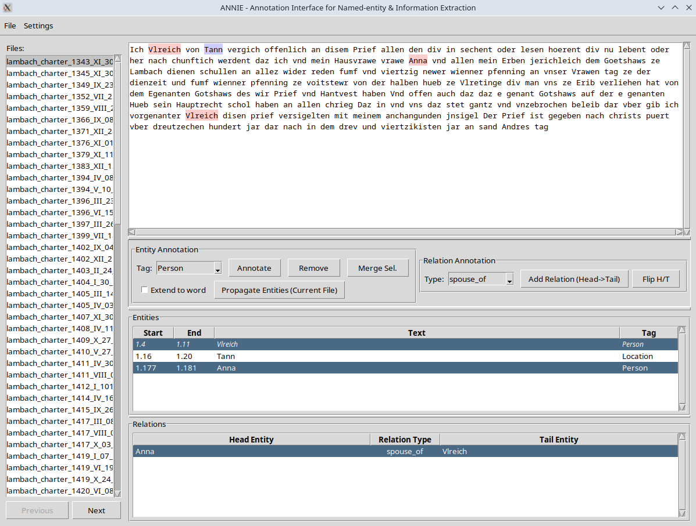

# ANNIE: Annotation interface for Named-entity &amp; Information Extraction

ANNIE is a lightweight desktop application that provides a user-friendly interface for annotating text files with entities and relations. It's designed to help researchers, linguists, and NLP practitioners create high-quality annotated datasets for named entity recognition (NER) and relation extraction tasks.

<p align="center">
  
</p>

## Features

- **Text Annotation**: Mark spans of text as entities with custom tags (Person, Organization, Location, etc.)
- **Relation Annotation**: Create directed relations between entities (e.g., "works_at", "born_on")
- **Batch Processing**: Load entire directories of text files and annotate them sequentially
- **Entity Propagation**: Automatically tag matching text spans across all files
- **Dictionary-based Annotation**: Import entity dictionaries to automatically annotate text
- **Entity Merging**: Merge multiple entity mentions that refer to the same entity
- **Relation Flipping**: Easily reverse the direction of relations
- **Word Boundary Extension**: Option to extend annotations to complete words
- **Color-coded Visualization**: Entities are highlighted in the text with tag-specific colors
- **JSON Export**: Save annotations in a structured JSON format for downstream processing

## Getting Started

### Prerequisites

- Python 3.6 or higher
- Tkinter (usually included with Python installations)

### Installation

1. Clone this repository or download the source code
2. Navigate to the directory containing the code
3. Run the application:

```bash
python annie.py
```

<p align="center">
  
</p>

## Basic Usage

### 1. Loading Files

1. Start by clicking **File → Open Directory**
2. Select a directory containing .txt files
3. The first text file will be loaded automatically
4. Navigate between files using the **Previous** and **Next** buttons or select files from the list

### 2. Entity Annotation

1. Select text in the main text area
2. Choose an entity tag from the dropdown menu
3. Click **Annotate** to mark the selection as an entity
4. The entity will be highlighted in the text and appear in the Entities list

### 3. Relation Annotation

1. Select two entities from the Entities list (first = head, second = tail)
2. Choose a relation type from the dropdown menu
3. Click **Add Relation (Head→Tail)** to create a directed relation
4. The new relation will appear in the Relations list

### 4. Saving Annotations

- Click **File → Save Annotations** to export all annotations as a JSON file
- Annotations are saved with relative file paths when possible

## Advanced Features

### Managing Entity Tags and Relation Types

- Click **Settings → Manage Entity Tags** to add, remove, or edit entity tags
- Click **Settings → Manage Relation Types** to customize relation types

### Entity Propagation

- Annotate entities in one file, then click **Propagate Entities (Current File)** to find and annotate matching text across all files
- Check **Extend to word** to automatically extend annotations to complete word boundaries

### Dictionary-based Annotation

1. Create a tab or space-separated text file with entity text and tags
   ```
   New York City    Location
   John Smith       Person
   ```
2. Click **Settings → Load Dictionary & Propagate Entities**
3. Select your dictionary file
4. ANNIE will search all files and annotate matching text spans

### Entity Merging

1. Select multiple entities in the Entities list (use Ctrl/Shift+click)
2. Click **Merge Sel.**
3. All selected entities will be merged to share the same ID
4. Relations will be updated automatically

### Relation Manipulation

- Select a relation and click **Flip H/T** to reverse its direction
- Select a relation and click **Remove Relation** to delete it

## Data Format

ANNIE saves annotations in JSON format:

```json
{
  "file1.txt": {
    "entities": [
      {
        "id": "a1b2c3...",
        "start_line": 1,
        "start_char": 10,
        "end_line": 1,
        "end_char": 20,
        "text": "John Smith",
        "tag": "Person"
      },
      ...
    ],
    "relations": [
      {
        "id": "d4e5f6...",
        "type": "works_at",
        "head_id": "a1b2c3...",
        "tail_id": "g7h8i9..."
      },
      ...
    ]
  },
  "file2.txt": {
    ...
  }
}
```

## Tips & Tricks

- **Navigation**: Press Tab to cycle through UI elements
- **Selection**: Double-click a word to select it
- **Extend Selection**: Triple-click to select an entire line
- **Workflow**: Annotate entities in all files first, then add relations
- **Sorting**: Click column headers in the Entities or Relations lists to sort
- **Dictionary Format**: When creating dictionary files, put one entity per line with the tag separated by a tab or space

## Troubleshooting

- If text highlighting doesn't appear, try clicking on another file and then back
- Ensure your text files use UTF-8 encoding for best compatibility
- If a relation can't be created, ensure you've selected exactly two entities
- Check that entity tags and relation types are defined before annotating


## License

Apache 2.0
