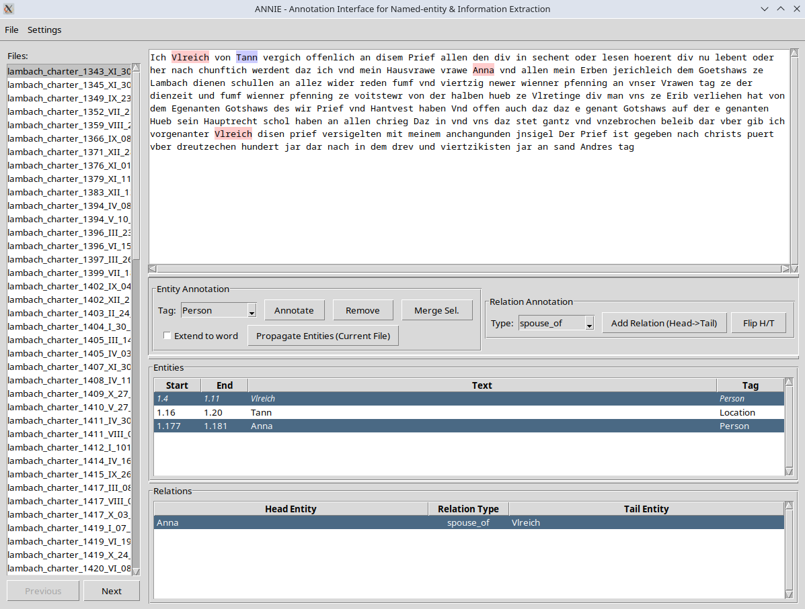

# ANNIE - Annotation Interface for Named-entity & Information Extraction

[](https://opensource.org/licenses/Apache-2.0)

ANNIE is a lightweight, robust, Python-based desktop application designed for annotating text files with named entities and directed relations. Built with Tkinter, it offers a user-friendly interface for researchers, linguists, and NLP practitioners to create high-quality annotated datasets for named entity recognition (NER) and relation extraction tasks.

ANNIE goes beyond manual annotation by integrating **Hybrid Ensemble AI** (combining Hugging Face models with local Session Memory) and a **Generative LLM Agent** powered by a native **RAG (Retrieval-Augmented Generation)** engine for highly accurate, context-aware pre-annotations.

<p align="center"\>

</p\>

## Features

  - **Hierarchical Entity Annotation**: Tag text spans using customizable layers (e.g., CORE, ANALYTICAL, SPAN). Dropdown menus are alphabetically sorted for readability, while hotkeys preserve your custom hierarchy.
  - **Relation Annotation**: Define directed relations between entities (e.g., "spouse\_of", "works\_at").
  - **Generative LLM Agent (RAG-powered)**: Connect to OpenAI, Anthropic (Claude), Together AI, or Hugging Face APIs. Uses a native TF-IDF-based Retrieval-Augmented Generation approach to find the most relevant human-annotated examples in your session for highly accurate Few-Shot prompting.
  - **Hybrid AI Pre-annotation**: Run local/downloaded Hugging Face token-classification models ensembled with ANNIE's Session Memory to pre-annotate texts.
  - **Secure API Key Management**: API keys are securely loaded and saved locally in a `.env` file, ensuring they are never accidentally shared via session files.
  - **Selective Dictionary Export & Propagation**: Export specific tags to a TSV dictionary, and selectively propagate dictionary terms only to specifically chosen files in your corpus.
  - **Global Search**: Press `Ctrl+F` to search for specific terms across the entire loaded session.
  - **Sentence-level Conversion**: Automatically split your document-level session into sentence-level files (ideal for training standard NER models) with robust boundary detection.
  - **Entity Merging/Demerging**: Merge multiple mentions of the same entity or separate them via right-click.
  - **Session Management**: Save and load annotation sessions to resume work without losing progress.
  - **Export/Import**: Support for CoNLL-2003 and spaCy JSONL formats.

## Getting Started

### Prerequisites

  - **Python**: 3.6 or higher.
  - **Required Libraries**: `tkinter` (included with Python), `json`, `os`, `shutil`, `pathlib`, `uuid`, `itertools`, `re`, `time`, `threading`, `math`, `collections`. (No external dependencies for the core and RAG engine\!).
  - **Optional Libraries**: `transformers` and `torch` for local Hybrid AI pre-annotation (`pip install transformers torch`), `requests` for Generative LLM APIs.

### Installation

1.  Clone this repository or download the source code.
2.  Navigate to the project directory.
3.  *(Optional but recommended)* Add `.env` to your `.gitignore` to keep your API keys secure.
4.  Run the application:
    ```bash
    python annie.py
    ```

<p align="center"\>

</p\>


## Basic Usage

### 1\. Loading Files

1.  Go to **File → Open Directory** and select a folder with `.txt` files.
2.  Files load in alphabetical order; the first file displays automatically.
3.  Use **Previous**/**Next** buttons or click a file in the listbox to navigate.

### 2\. Entity Annotation

1.  Drag to select text or double-click a word in the text area.
2.  Choose a tag from the alphabetically sorted Entity Tag dropdown, or press `0-9` to use your hierarchical hotkeys.
3.  Click **Annotate Sel** to tag the selection.
4.  Single-click an annotated span to remove it quickly.

### 3\. Relation Annotation

1.  Select exactly two entities in the Entities list (first = head, second = tail).
2.  Choose a relation type from the Relation Type dropdown.
3.  Click **Add Relation (Head→Tail)** to create the relation.

## Advanced Features

### Generative LLM Agent & In-Context Learning

  - Press `g` or go to **Settings → Generative LLM Agent (Few-Shot)...**.
  - Select your provider (OpenAI, Claude, Together AI, HF) and enter your API key (saved securely to a local `.env` file).
  - ANNIE uses a built-in **TF-IDF engine** to search your previously annotated files and injects the most mathematically similar documents into the prompt as Few-Shot examples, maximizing accuracy for repetitive/formulaic texts (e.g., historical or legal documents).

### Hybrid AI & Pre-annotation

  - Press `a` or go to **Settings → Pre-annotate with Hybrid AI...** to tag entities using a pre-trained HF model combined with your current Session Memory.

### Selective Dictionary Export & Propagation

  - **Export**: Go to **File → Export Dictionary...**, select the specific tags you want to export, and save them as a TSV file.
  - **Propagate**: Go to **Settings → Load Dictionary & Propagate...**. After loading a dictionary, a dialog allows you to select *exactly which files* the propagation should be applied to, minimizing false positives in unrelated texts.

### Convert Session to Sentence Mode

  - Go to **File → Convert Session to Sentence Mode...** to automatically split your large document files into sentence-by-sentence `.txt` files while perfectly migrating all existing annotations and relations.

### Global Search

  - Press `Ctrl+F` to search for a word or phrase across the entire corpus. Double-click a search result to jump straight to that file and highlight the occurrence.

## Data Format

Annotations are stored in standard JSON format:

```json
{
  "file1.txt": {
    "entities": [
      {
        "id": "a1b2c3...",
        "start_line": 1,
        "start_char": 10,
        "end_line": 1,
        "end_char": 20,
        "text": "John Smith",
        "tag": "PER",
        "propagated": false
      }
    ],
    "relations": [
      {
        "id": "d4e5f6...",
        "type": "works_at",
        "head_id": "a1b2c3...",
        "tail_id": "g7h8i9..."
      }
    ]
  }
}
```

*Note: API Keys are exclusively stored in your local `.env` file and are **never** written to the session JSON file.*

## Tips & Tricks

  - **Hotkeys**: Use `0-9` to select/relabel tags, `a` for Hybrid AI pre-annotation, `g` for the Generative LLM Agent, and `Delete` to remove entities.
  - **Dictionary Format**: Use Tab-Separated Values (TSV) or Space-Separated values: `text \t tag` (e.g., `New York \t LOC`).
  - **Read-only Text**: The text area is strictly immutable to ensure annotation offsets never break. Use the mouse or hotkeys for actions.

## Version History

  - **1.14** (2026):
      - **Generative LLM Agent**: Added native RAG TF-IDF engine for context-aware Few-Shot prompting.
      - **Security**: Moved API key storage entirely out of session files and into a local `.env` file.
      - **UX Improvements**: Alphabetically sorted tag dropdowns; selective multi-file dictionary propagation; selective TSV dictionary export.
      - **Global Search**: Added Ctrl+F functionality across the entire session.
      - **Sentence Conversion**: Added robust document-to-sentence splitting.
  - **1.12**:
      - Added Hybrid AI pre-annotation.
      - Implemented multi-label and overlapping annotation support.
      - Added demerge functionality and CoNLL / spaCy JSONL export.
  - **0.60 - 0.75**: Base features, read-only UI, session management, and visual flagging.

## Cite

### APA Style

Kovács, T. (2026). *ANNIE: Annotation Interface for Named-entity & Information Extraction* (Version 1.14) [Computer software]. GitHub. [https://github.com/kreeedit/ANNIE](https://github.com/kreeedit/ANNIE)

### BibTeX

```bibtex
@software{Kovacs_ANNIE_2026,
  author = {Kovács, Tamás},
  title = {{ANNIE: Annotation Interface for Named-entity & Information Extraction}},
  version = {1.14},
  publisher = {Zenodo},
  year = {2026},
  doi = {10.5281/zenodo.15805548},
  url = {https://github.com/kreeedit/ANNIE}
}
```

## License

Apache 2.0
